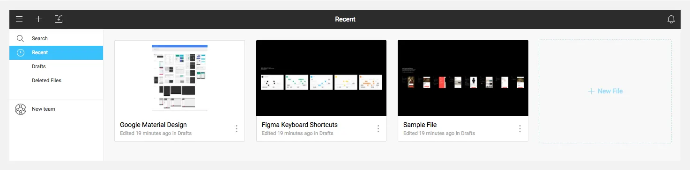
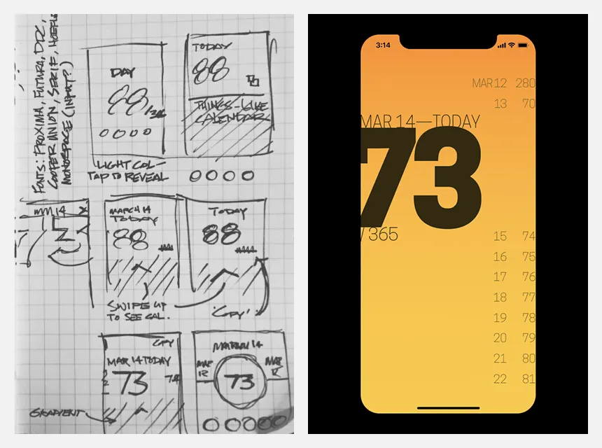

I recently dove headfirst into Figma, a browser-based(!) design tool made for modern UI and web design. After two-ish weeks of steady usage, I’m ready to call it: it’s easily the best design tool I’ve used.

## Why now
When Figma rolled out in late 2015, it looked impressive. But at the time, I had too many excuses holding me back from giving it a shot. My team’s workload and deadlines didn’t lend themselves to learning new tools. The tools I was already using were good enough. The list goes on.

Today, I’m running my own [design studio](https://www.flow14.com/) and I’m taking time to reevaluate the tools I rely on. Sketch is impressive — it runs circles around the Adobe tools I use most — but I’m hesitant to spring for a license. I’ve already paid for an annual Adobe Creative Cloud subscription, and it’s good enough for my day-to-day design needs.

But when a Figma-authored post on [John Maeda’s Design in Tech report](https://www.figma.com/blog/the-6-design-trends-john-maeda-predicted-in-his-state-of-the-union/) floated through my stream, I decided to give Figma another look. Reading comparisons of Figma and Sketch, even somewhat [dated posts](https://medium.com/@mengto/figma-vs-sketch-c01e5e74eddd) comparing their merits put Figma on top. Plus, the price is right for a longer-term test — it’s free for up to 2 editors.

## Getting started
After a quick and easy sign up process, I was happy to find Figma provides a handful of starter files. Reviewing their sample file was a great way to learn the UI, tools, and basic tips and tricks. It’s a great onboarding experience— they’ve eliminated the dreaded blank page effect and made it super-easy to get started and get comfortable with the tools.

Once I was comfortable with the basics, I created my first screens. I keep a [Spark File](https://medium.com/the-writers-room/the-spark-file-8d6e7df7ae58) — a running list of hunches, ideas, and inspiration — for just this sort of thing. I chose a simple app idea — it’s dedicated to displaying the day of the year. I have a long-running 365 photography project, so I’m a frequent visitor to poorly-designed online DoTY calendars. I’ve always thought a simple app would make my life easier.

After a few quick sketches, I jumped over to Figma and started designing. Later that day, I had screens ready to share. By the following day, I had basic interactions prototyped and was able to try them on my phone thanks to Figma’s impressively easy-to-use mirroring app.

## Since my first starter exercise, I’ve used Figma to make:
- Page mockups for a website I’m working on — thanks to Figma’s components, I should be able to easily create simple style guide and pattern library for my clients.
- A library of regularly used logos.
- A scratchpad for random ideas, which I’ve used to quickly try new responsive layouts, test grids, generate patterns, and more.

Simply put: Figma is a powerful design tool. It’s easy to get started: you can use it in its native environment, the browser (which is crazy impressive). They also offer a slick desktop app. And compared to Adobe’s software, it’s much easier on my battery and CPU.

## For the curious minds
So if you’re a designer who’s been on the fence about [trying Figma](https://www.figma.com/), use a little time during a lunch break, evening, or a bit of time on the weekend to give it a shot. There’s a good chance you’ll get hooked.

For the curious, here are a few of the articles and resources I found most helpful as I was getting started:

1. The aforementioned [Figma vs Sketch comparison](https://medium.com/@mengto/figma-vs-sketch-c01e5e74eddd). A little dated, but the points have aged well.
2. For wrapping your head around the potential of Figma: [How to streamline your UI/UX workflow with Figma](https://medium.com/nicole-the-designer/how-to-streamline-your-ui-ux-workflow-with-figma-b72c30596435) from Prototypr and [Component architecture in Figma](https://www.figma.com/best-practices/component-architecture/) from Figma Design
3. For tips and tricks, Figma regularly shares roundups — [FigmaTip Roundup 2.0](https://www.figma.com/blog/figmatip-roundup-2-0/) and [FigmaTip Roundup 6.0](https://www.figma.com/blog/figmatip-roundup-6-0/) were especially helpful.
4. Getting more advanced: [Waiting for a sign to start building your design team’s component library?](https://www.figma.com/blog/figmatip-roundup-6-0/) – on how Gusto used Figma to build a component library.