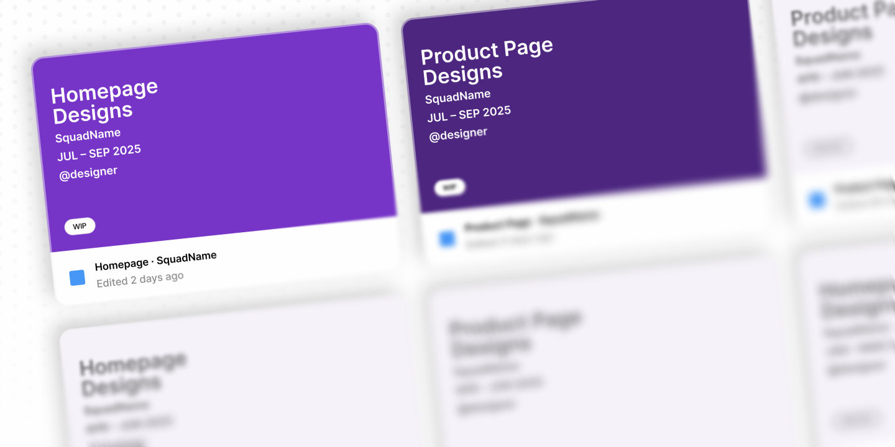
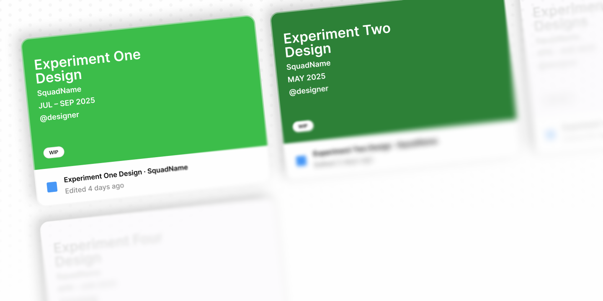
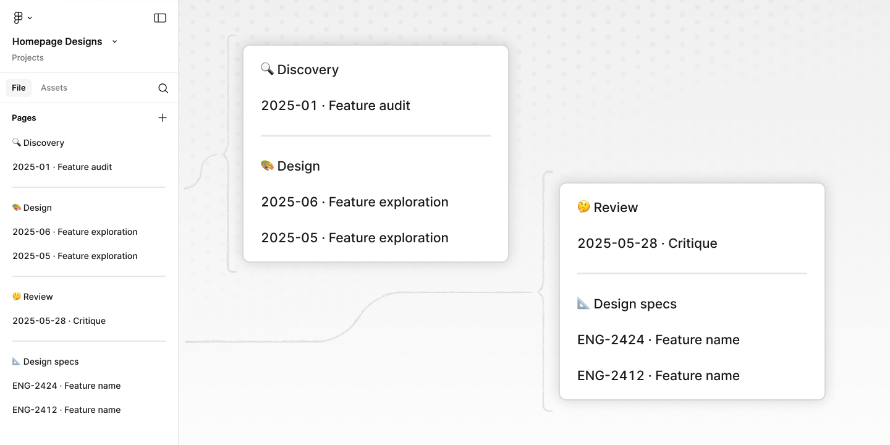

At work, a fellow product designer asked how other designers structure their Figma files to support collaboration and how we flow from roving design explorations to focused design specifications. 

In this post, I'll cover how I organize my files, how I structure pages within those files, and how I move from design explorations to dev handoff.

## Context setting

We work in squads, which consist of a designer, product manager (PM), engineering manager, and 6-ish engineers. Each squad has a particular focus area and squads delivering on similar tracks of work are organized into groups. Which is important for the next bit, collaboration.

### Who do I collaborate with?

Multiple times a week, I share ideas and designs with my squad. I also join weekly critiques with the other product designers in my group where we share work and feedback. There are other touch points, but these key interactions shape how I think about organizing my work in Figma.

## How I organize my Figma files

There are two ways I organized files, determined by the needs of the squad I'm working with.

My primary squad works across several pages on the website, developing experiments and features scoped to a page. I've found the best approach is to sort my designs explorations into page-specific files. I might have a Figma file dedicated to the homepage, another for the product page, and so on.

**Why this works** we run a *lot* of experiments. This structure helps me quickly find the right designs when I'm sharing work in progress or getting feedback. It also limits the number of files I need to manage and makes it simple for my squad to find what they're looking for because there's one place to look.

Occasionally, I work with other squads who need design support and I adapt my approach. For example, I worked with an App squad who focused on a specific screen on iOS. Given the way the squad worked, I found it was best to create one file per feature or experiment.

## How I organize pages in each file

I use a combination of **sections** for different stages of the design process, and **pages** for each project and steps (we have a custom plugin to automatically create these sections):

**The sections**
- **Discovery** – includes pages for research and data, past work, and audits. Anything relevant to our track of work.
- **Design** – the busiest section of any file. Each experiment or feature gets its own page, sorted by date and topic (e.g. `2025-JUN · Feature exploration`). 
- **Review** – when I'm ready to share work for feedback, I'll create a new page in this section and copy a specific design and relevant context from the design section. This helps focus the feedback because people don't have to hunt through all my design explorations. It also helps me keep track of any feedback (in the form of comments in Figma).
- **Design specs** – this is the handoff to engineers, and source of truth for what we build. I'll cover this in more detail in the next section.

## Design explorations

On each design page in my file, a single exploration may go through several rounds of changes and refinements – starting with a bunch of exploratory concepts all the way through the final design we've agreed to build. All those designs are contained on a single page, grouped using Figma's sections. Keeping everything on a single page allows me to grab elements I want to reuse and makes it easy for others to reference earlier ideas when we're weighing different treatments. Using sections allows me to share links to specific stages and tailor what I'm sharing based on who will be looking at the work and the type of feedback I need. This is a great way to see how designs evolve based on all the thoughtful feedback people share – I can see how designs and ideas get sharper as they move through the process.

## How I prep designs for handoff

When we agree a design is done and ready to hand off for development, I create a new page under **design specs**. I name each page using a ticket number and experiment title (`ENG-2424 · Feature name`). Each page includes the treatment and control designs, page-level specs, specs for key features on the page, any states we need to account for, and specs for up to six breakpoints. Each of these are grouped into sections so I can point people to the right place.

I arrived at this process through a combination of experience and by applying a design process to my design process. If I have trouble finding a design or notice others getting lost or confused – I note that as a signal there's room for improvement. Like any good design process, I take time to think through what's working and not working, iterate on the system, and observe whether my changes helped improve collaboration.

